# QXBoost — Automated Loyalty & Retention Protocol
"The 'Diamond Hands' Engine for the Qubic Exchange"
```markdown
<!-- Sponsor button -->
[](https://github.com/sponsors/Ekisa02)

<!-- Optional alternative GitHub Sponsors badge -->
[](https://github.com/sponsors/Ekisa02)
```

[](https://github.com/Ekisa02/QXBoost-Automation)
[](#license)
[](#tech-stack--tools)
[](#tech-stack--tools)

📋 Table of Contents
- Overview
- The Problem
- The Solution
- How It Works (Architecture)
- Tech Stack & Tools
- Key Features
- Setup & Logic
- Future Roadmap
- Acknowledgments
- License
- Maintainers

---

📖 Overview
------------
QXBoost is a fully automated, no-code loyalty layer built for the Qubic Exchange (QX). It incentivizes long-term investing by identifying "Whales" (large investors) in real-time, tracking their holding duration, and automatically distributing rewards (digital assets/NFTs) to wallets that hold through the retention window.

By combining the Qubic API with Google Gemini AI and powerful visual automation on Make.com, QXBoost turns passive holding into an active, gamified community event — the "Diamond Hands" engine.

---

💥 The Problem
--------------
Crypto projects frequently face "Mercenary Capital":
- High churn: Investors buy and dump after small pumps.
- Zero loyalty: No real-time automated reward structure for holders.
- Manual overhead: Tracking wallets and sending rewards by hand is slow, expensive, and error-prone.

---

💡 The Solution
---------------
QXBoost acts as a retention guardrail that:
- Listens to the Qubic on-chain stream 24/7.
- Detects large buy orders ("whales").
- Logs and monitors wallet holding duration.
- Verifies post-hold ownership.
- Automatically issues attractive, on/off-chain rewards (emails, NFTs, future on-chain airdrops).

Example conditional flow:
Buy > 10,000 CFB? → Start tracking → Hold > 30 days? → Send reward

---

⚙️ How It Works (Architecture)
-------------------------------
The system follows a "Listen → Filter → Verify → Reward" flow orchestrated with Make.com and small, transparent automations.

```mermaid
graph TD
    A[📢 Webhook: Listen for Buy Order] --> B{💰 Filter: Value > 10k?}
    B -- No --> Z[Stop]
    B -- Yes --> C[📝 Log to Google Sheets]
    C --> D[🤖 AI: Generate Hype Message]
    D --> E[💬 Broadcast: Discord & Telegram]
    E --> F[⏳ Wait: Holding Period]
    F --> G{🔍 API Check: Still Holding?}
    G -- No --> Z[Stop]
    G -- Yes --> H[🤖 AI: Generate Success Report]
    H --> I[🎁 Action: Email Reward + NFT]
```



Flow breakdown:
- Listen: Webhooks or polling to Qubic API detect buy transactions against the target contract.
- Filter: Reject dust trades; only trigger on configured thresholds (e.g., >= 10,000 CFB).
- Log: Capture wallet, tx hash, timestamp in Google Sheets (or your database).
- Hype: Use Google Gemini to craft tailored, high-engagement announcements and HTML reports.
- Hold: Wait the configured retention window (default 30 days).
- Verify: Re-check on-chain balance and ownership to avoid Sybil/fake holds.
- Reward: Send email + NFT (off-chain or mint) and prepare for future on-chain airdrop.

---

🛠 Tech Stack & Tools
---------------------
We built QXBoost with a no-code-first approach to speed up deployment and make iterations frictionless.

- Orchestration: Make.com (scenarios connecting all steps)
- Data Source: Qubic API (real-time transactions & balances)
- Intelligence: Google Gemini (dynamic text + HTML reports)
- Database / Log: Google Sheets (acts as a lightweight ledger)
- Notifications: Discord & Telegram (community alerts via webhooks/bots)
- Communication / Rewards Delivery: Gmail (personalized HTML "Loyalty Reports")
- (Planned) On-chain tools: Qubic Wallet integration for gas/token airdrops

---

✨ Key Features
----------------
1. 🕵️ Real-Time Whale Detection  
   Instant monitoring of the QX smart contract with configurable value thresholds to ignore dust trades.

2. 🗣️ AI-Powered Community Hype  
   Google Gemini crafts energizing alerts and beautifully formatted reports instead of boring static messages.
   Example: "🚨 BOOM! A new whale just swept the floor with 50,000 CFB! The Diamond Hands are forming! 💎🚀"

3. 🛡️ Sybil-Resistant Verification  
   A double-check step after the holding period ensures assets have not been moved before issuing rewards.

4. 📄 Automated HTML Loyalty Reports  
   A colorful, professional HTML report is emailed to eligible wallets proving their eligibility for rewards.

5. 🔁 No-Code, Fast Iteration  
   Make.com scenarios make the product easy to modify and iterate without touching backend code.

---

⚙️ Setup & Logic
-----------------
This project is designed to be implemented on Make.com with connected services. Below are the high-level setup steps and the logic controls you should configure.

Prerequisites
- Make.com account and scenario editor access
- Qubic API credentials (endpoint access)
- Google Cloud project with access to Google Gemini (AI)
- Google Sheets for logging (or an alternative DB)
- Discord & Telegram webhook endpoints
- Gmail account with app password (for sending HTML reports)
- Optional: NFT minting service or wallet for distributing NFTs

Core Steps
1. Connect a Qubic webhook or scheduled query to detect buys on the target contract.
2. Add a Filter module: trade_value >= THRESHOLD (default 10,000 CFB).
3. On pass:
   - Log tx details to Google Sheets (Wallet, tx_hash, amount, timestamp).
   - Call Google Gemini to generate a hype message + HTML report template.
   - Post the hype message to Discord & Telegram via their webhooks.
4. Start a timer (Delay module) for the holding period (default 30 days).
5. After delay, call Qubic API to verify current wallet balance and token ownership.
6. If holding criteria still met:
   - Call Gemini to generate a success report and email body.
   - Send an email via Gmail with the HTML "Loyalty Report".
   - Trigger NFT minting/mailing flow (if configured).

Configurable Variables
- TRADE_THRESHOLD_CFB (default: 10_000)
- HOLDING_PERIOD_DAYS (default: 30)
- HYPE_TEMPLATE (Gemini prompts / HTML snippets)
- REWARD_TYPE (email-only, NFT, or on-chain airdrop)
- REPORT_BRANDING (logo, colors, legal disclaimers)

Security & Best Practices
- Use least-privilege API keys and rotate periodically.
- Validate webhook payloads and sign each webhook if possible.
- Rate-limit Gemini usage and cache templates for repeated messages.
- Keep Google Sheets data private (share only with the service account).

---

🚀 Future Roadmap
------------------
- Phase 1 (Current): Detection, Logging, AI messaging, Off-chain rewards (Email / NFT minting & delivery).
- Phase 2: On-chain airdrops — integrate Qubic Wallet connection to automatically send CFB as gas/token rewards.
- Phase 3: DAO Integration — Diamond Hand NFT holders gain gated access to private Discord channels and governance voting.
- Phase 4: Advanced anti-Sybil measures — reputation scoring, multi-sig confirmations, and cross-chain integrations.

---

🙏 Acknowledgments
------------------
Huge thanks to:
- EasyConnect - for iniatial setup and start of automations.
- Qubic.org — for the ultra-fast network and open API documentation.
- Make.com — for their powerful visual automation platform.
- Google AI Studio — for Gemini models that power the messaging and reports.
- Discord and Telegram — for robust webhook and community tools.
Built with ❤️ by the QXBoost Team.

---

📜 License
----------
MIT — see LICENSE file for details.

---

👥 Maintainers / Contact
------------------------
- QXBoost Team — repo: Ekisa02/QXBoost-Automation  
For feature requests, issues, or to help integrate on-chain payouts, open an issue or reach out via the project channels.
